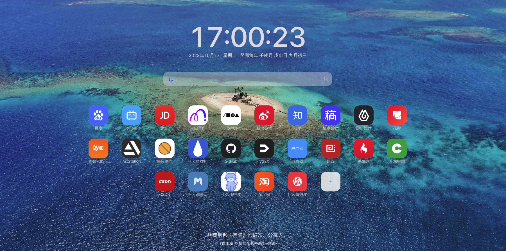
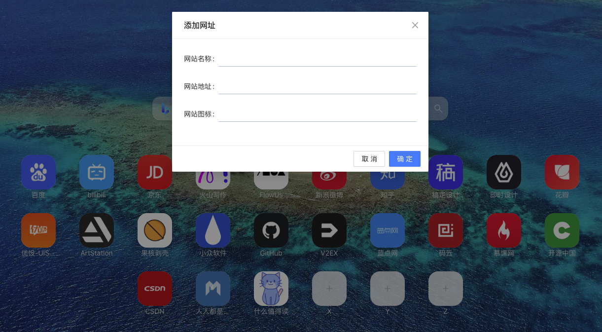

# simple-homepage
一个最精简的个人主页/A minimalist personal homepage

      
      

### 说明
最初的想法是有个简单的个人主页即可,添加自己部署的一些内网服务,方便快速访问,不用记端口号;

研究过其他的个人主页项目,做的也都很不错,但是太复杂,功能太多了,配置文件用yml也比较麻烦, 比如集成了docker监控,实时新闻等等...

所以自己简单做了个这个项目,构建后不到1M,部署把dist目录下载下来,找个NGINX之类代理下即可;

#### 特点
1.支持当前页直接添加,最终数据保存成json到localstorage;

2.可以初始化模板,把localstorage里编辑好的json复制出来,在静态目录下创建个config.json代理下即可,参考dist下的config.json;

3.加入了农历日期和随机诗句;

4.有26个空位置,对应了键盘的26个字母,按下对应字母自动打开对应网站;

#### todo
1.直接在当前页修改(现在只能改配置的config.json);

2.从公共库里抓标题相关的图标;

3.自动换背景图;

